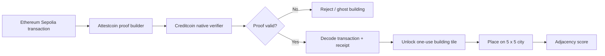

# Proofopolis

**Your wallet is your deck.**

Proofopolis is an isometric city-building puzzle where players transform cryptographically verified Ethereum activity into strategic building tiles on Creditcoin.

Built for **BUIDL CTC 2026 Fall, Gaming Track**.

## The rule

A source-chain transaction does not become a building just because the frontend says it exists. The Creditcoin game contract must accept its Attestcoin proof first.

**No valid proof = no building.**

That makes Attestcoin part of the game rule itself rather than a decorative integration.

## Game loop

1. Connect a wallet and choose an Ethereum Sepolia transaction.
2. Build an Attestcoin proof for that transaction.
3. Submit the proof to the Proofopolis contract on Creditcoin.
4. The contract verifies and decodes the proven transaction and receipt.
5. A valid, successful, authorized and unused action unlocks a city tile.
6. Place the tile on the 5 x 5 city board.
7. Neighboring buildings create score bonuses.
8. Replaying the same proof is rejected.

The MVP focuses on three building categories and a small board so the proof-to-game loop stays obvious in a one-minute demo.

## Attestcoin integration

`contracts/src/Proofopolis.sol` uses the native query verifier through the current `@gluwa/asc-contracts` interface. After verification, it decodes the proven EVM transaction and receipt and checks:

- Sepolia source chain key
- successful source receipt
- source transaction sender matches the player
- allowlisted source contract
- expected event signature and indexed player
- replay protection derived from the proven transaction position

Only after those checks does Creditcoin mint a one-use game tile.

The web proof endpoint uses `@gluwa/usc-sdk` to request proof data for a supplied transaction hash. See `docs/ATTESTCOIN_INTEGRATION.md` for the technical path.

## Architecture



## Run locally

```bash
npm install
npm test
npm run contracts:compile
npm run dev
```

Copy `.env.example` to `.env.local` to configure the proof-builder infrastructure and deployed CC3 contract address.

## Project structure

- `app/` - Next.js interface and proof-builder API route
- `components/ProofopolisGame.tsx` - primary city-building experience
- `components/Building.tsx` - city tile visuals
- `contracts/src/Proofopolis.sol` - Attestcoin verification, replay protection, tile issuance and placement
- `contracts/src/SeedActions.sol` - simple Sepolia actions used for a deterministic testnet demo
- `lib/game.ts` - deterministic board and scoring helpers
- `tests/` - gameplay and verification-support tests
- `docs/` - Attestcoin integration and architecture notes

## Demo safety

Proofopolis is a hackathon testnet prototype. It is not audited and does not use real-value assets.
