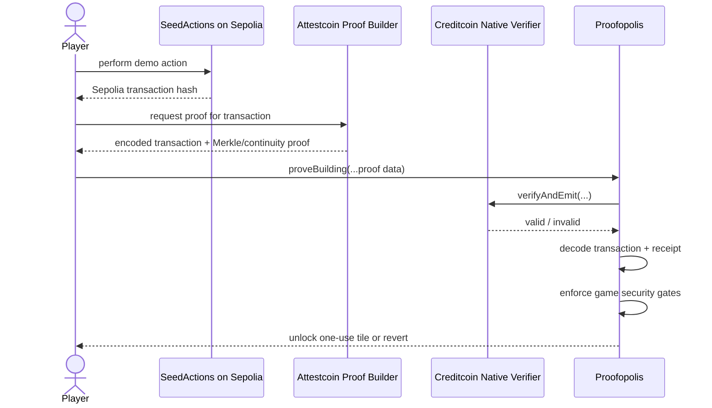
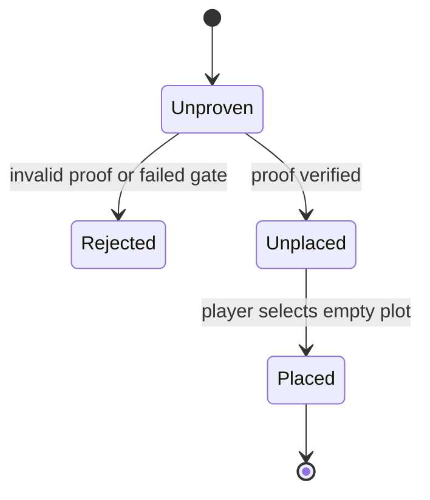

# Attestcoin Integration

This page documents the security boundary that turns Ethereum activity into playable Proofopolis buildings.

## First principle

Proofopolis does not trust a transaction hash typed into the website. It does not trust a screenshot, an indexer response, or a frontend label. A building becomes playable only after the Creditcoin contract accepts cryptographic evidence for the source transaction and the game-specific checks pass.

> No valid Attestcoin proof, no building.

## Data path



The web endpoint in `app/api/proof/route.ts` uses `@gluwa/usc-sdk` and `ProofBuilder.getProof(txHash)` with Sepolia chain key `1`. Proof data is then intended to be submitted by the player's wallet to `Proofopolis.proveBuilding` on CC3.

## Contract verification

`contracts/src/Proofopolis.sol` calls the native verifier through `@gluwa/asc-contracts`. The contract derives the proven transaction index from the Merkle proof and creates a deterministic proof identifier from the source chain, block height and transaction index.

A proof must survive every gate below before state changes:

| Gate | Why it exists |
| --- | --- |
| Supported action | Prevents arbitrary event classes from minting tiles. |
| Sepolia chain key | Stops proofs from an unintended source chain. |
| Replay check | A source transaction can unlock only one tile. |
| Native proof verification | Establishes that the encoded source data belongs to the attested chain history. |
| Receipt status = success | A reverted source transaction cannot create a building. |
| `transaction.from == player` | A player cannot steal another wallet's activity. |
| Allowlisted source emitter | Random contracts cannot imitate a valid game action. |
| Expected event signature | The source action must match the requested building category. |
| Indexed player topic | The event must refer to the player claiming the tile. |

Only after all checks pass does the contract mark the proof consumed and issue the tile.

## Replay protection

The contract computes:

```text
proofId = keccak256(chainKey, blockHeight, transactionIndex)
```

`consumedProofs[proofId]` is checked before verification state is accepted and set to `true` before the newly issued tile can be used. Reusing the same proven source transaction therefore reverts with `proof already consumed`.

For the demo this is an important visible failure case. The first submission creates a building. The second submission of the same proof must fail.

## Building lifecycle



A tile also cannot be placed twice, outside the 5 x 5 board, on another player's board, or on an occupied plot.

## Failure paths judges can test

The strongest demo is not only the success path. Proofopolis should visibly demonstrate that the verifier changes what the game accepts.

1. **Valid proof:** unlocks a tile.
2. **Replay:** submit the same proof again and show `proof already consumed`.
3. **Wrong wallet:** a wallet other than the source transaction sender cannot claim the tile.
4. **Failed source transaction:** receipt status prevents issuance.
5. **Wrong source/event:** an unrelated contract or event cannot unlock the requested building.
6. **Invalid proof:** native verification rejects the claim before game state changes.

The UI can represent rejection as a translucent ghost building that cracks and disappears. That animation is presentation only. The actual rejection must come from the contract.

## Testnet deployment order

1. Deploy `contracts/src/SeedActions.sol` to Ethereum Sepolia.
2. Deploy `contracts/src/Proofopolis.sol(seedActionsAddress)` to Creditcoin CC3 testnet.
3. Configure the proof-builder URL and deployed contract address in environment variables.
4. Perform one of the allowlisted `SeedActions` on Sepolia.
5. Wait until the source height is attested.
6. Request the proof using the proof API.
7. Submit the returned proof to `proveBuilding` from the same player wallet on CC3.
8. Place the unlocked tile and confirm the score changes.
9. Submit the same proof again to demonstrate replay rejection.

## Trust model

Attestcoin proves source-chain data. Proofopolis still has to decide what that proven data means for the game. That is why proof verification and application-level checks are separate steps.

The proof answers: **"Was this source data included in the attested chain history?"**

Proofopolis then answers: **"Is this successful transaction from this player, from the source we accept, for an action that is allowed, and has it already been used?"**

Both answers must be yes before a building exists.

## Prototype notice

Proofopolis is a hackathon testnet prototype. It is not audited. Use development wallets with testnet assets only.
